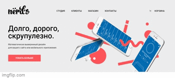
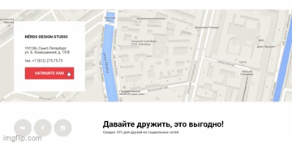

# Nerds
Сайт для дизайн-студии из Краснодара.

Просмотреть сайт можно по [ссылке](https://bertrana.github.io/nerds_HTMLAcademy).

## Описание
Сайт состоит из двух страниц: главной и каталога. Главная страница сверстана, каталог в процессе.

На главной странице расположен слайдер, анимированный с помощью JS.

Кнопка "Напишите нам" показывает модальное окно с формой отправки письма.

## Документация

В формате psd:
- [Макет](./sources/nerds-index.psd) главной страницы;
- [Макет](./sources/nerds-catalog.psd) каталога;
- [Стайлгайд](./sources/styleguide.psd).

[Спецификация](./sources/specification-nerds.html.pdf) в pdf.